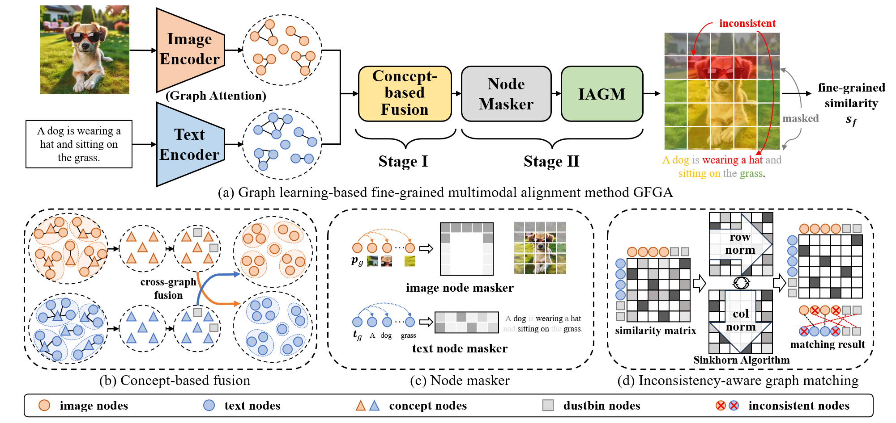

# Fine-Grained Multimodal Alignment for Image-Text Retrieval via Graph Learning

[](https://link.springer.com/article/10.1007/s11263-025-02686-y) [](https://link.springer.com/article/10.1007/s11263-025-02686-y)  



---

## 📋 Table of Contents
- [Environment Setup](#1-environment-setup)
- [Data Preparation](#2-data-preparation)
- [Fine-tuning CLIP](#3-fine-tune-clip)
- [Training GFGA](#4-train-gfga)
- [Citation](#5-citation)

---

## 1. Environment Setup

Our experiments are conducted using **Python 3.9** and **PyTorch 2.0.1**. 

1. Install PyTorch following the official instructions from the [PyTorch website](https://pytorch.org/get-started/previous-versions/). 
2. Install the [OpenAI CLIP](https://github.com/openai/CLIP) package.
3. Install the remaining dependencies using the provided `requirements.txt`:

```bash
pip install -r requirements.txt
```

---

## 2. Data Preparation

We evaluate our model on two widely used benchmark datasets: **Flickr30k** and **MS-COCO**. We use the standard Karpathy splits for both datasets.

### 2.1 Flickr30k Dataset
1. Download the images from the[Flickr30k dataset website](https://shannon.cs.illinois.edu/DenotationGraph/).
2. Download the annotations (`dataset_flickr30k.json`) from this [link](http://cs.stanford.edu/people/karpathy/deepimagesent/caption_datasets.zip).

Organize the downloaded files as follows:
```text
./data/flickr30k/
├── images/
│   ├── 1000092795.jpg
│   ├── ...
└── dataset_flickr30k.json
```

### 2.2 MS-COCO Dataset
1. Download the **2014 Train** and **2014 Val** images from the [MS-COCO website](https://cocodataset.org/#download).
2. Download the annotations (`dataset_coco.json`) from this [link](http://cs.stanford.edu/people/karpathy/deepimagesent/caption_datasets.zip).

Organize the downloaded files as follows:
```text
./data/MS-COCO/
├── train2014/
│   ├── COCO_train2014_000000000009.jpg
│   ├── ...
├── val2014/
│   ├── COCO_val2014_000000000042.jpg
│   ├── ...
└── dataset_coco.json
```

---

## 3. Fine-tune CLIP

GFGA is built upon CLIP. Before training the GFGA framework, you first need to fine-tune the standard CLIP model on the target dataset. 

**To fine-tune CLIP on Flickr30k:**
```bash
python train_clip.py --config_file=./configs/flickr30k_clip_config.json
```

**To fine-tune CLIP on MS-COCO:**
```bash
python train_clip.py --config_file=./configs/coco_clip_config.json
```

---

## 4. Train GFGA

Once CLIP is fine-tuned, you can train the GFGA model. 

> ⚠️ **Important Note:** The GFGA model trained on Flickr30k is initialized using the weights trained on MS-COCO. Therefore, **you must train GFGA on the MS-COCO dataset first.**

**Step 1: Train GFGA on the MS-COCO dataset**

```bash
python train_gfga.py --config_file=./configs/coco_gfga_config.json
```

**Step 2: Train GFGA on the Flickr30k dataset**
```bash
python train_gfga.py --config_file=./configs/flickr30k_gfga_config.json
```

---

## 5. Citation

If you find this repository useful for your research, please consider citing our paper:

```bibtex
@article{chen2026fine,
  title={Fine-Grained Multimodal Alignment for Image-Text Retrieval via Graph Learning: Fine-Grained Multimodal Alignment for Image-Text Retrieval via Graph Learning},
  author={Chen, Mao and Zhang, Xiangkai and Qi, Lu and Li, Xiangtai and Yang, Xu and Hoi, Steven CH and Liu, Zhiyong and Yang, Ming-Hsuan},
  journal={International Journal of Computer Vision},
  volume={134},
  number={3},
  year={2026},
  publisher={Springer US New York}
}
```
