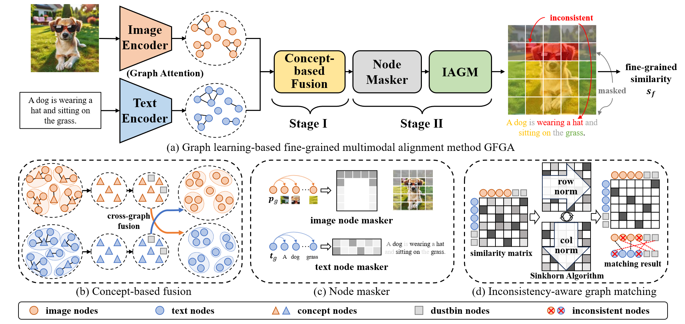

# Graph Learning-based Fine-Grained Multimodal Alignment for Image-Text Retrieval



## 1. Environment

Our experiments are conducted based on Python 3.9 and Pytorch 2.0.1. You can install Pytorch following the instructions of [Pytorch](https://pytorch.org/get-started/previous-versions/). In addition,  you may need to install clip from [OpenAI CLIP](https://github.com/openai/CLIP).

And you can use the following command to install other packages needed for experiments.

```
pip install -r requirements.txt
```

## 2. Data Preparation

Two benchmark datasets, Flickr30k and MS-COCO, are used in our experiment.

### 2.1 Flickr30k Dataset

You can download images of the Flickr30k dataset from the [Flickr30k dataset website](https://shannon.cs.illinois.edu/DenotationGraph/).

After downloading the images, please place them as:

```
./data/flickr30k/images/xxx.jpg
```

In addition, you can download `dataset_flickr30k.json` from the [link](http://cs.stanford.edu/people/karpathy/deepimagesent/caption_datasets.zip) and place it as:

```
./data/flickr30k/dataset_flickr30k.json
```

### 2.2 MS-COCO Dataset

You can download images of the MS-COCO dataset from the [COCO website](https://cocodataset.org/#download). Specifically, the images we used are 2014 Train images and 2014 Val Images, following the protocol of previous works. 

After downloading the images, please place them as as:

```
./data/MS-COCO/train2014/xxx.jpg
./data/MS-COCO/val2014/xxx.jpg
```

In addition, you can download `dataset_coco.json` from the [link](http://cs.stanford.edu/people/karpathy/deepimagesent/caption_datasets.zip) and place it as:

```
./data/MS-COCO/dataset_coco.json
```

## 3. Fine-tune CLIP

Since GFGA is built upon CLIP, you may need to fine-tune CLIP first on the corresponding dataset. You can use different configurations to fine-tune CLIP on different datasets. 

To fine-tune CLIP on the flickr30k dataset:

```
python train_clip.py --config_file=./configs/flickr30k_clip_config.json
```

To fine-tune CLIP on the MS-COCO dataset:

```
python train_clip.py --config_file=./configs/coco_clip_config.json
```

## 4. Train GFGA

After complete fine-tuning CLIP, you can use the following command to train GFGA on two datasets.

To train GFGA on the flickr30k dataset:

```
python train_gfga.py --config_file=./configs/flickr30k_gfga_config.json
```

To train GFGA on the MS-COCO dataset:

```
python train_gfga.py --config_file=./configs/coco_gfga_config.json
```

